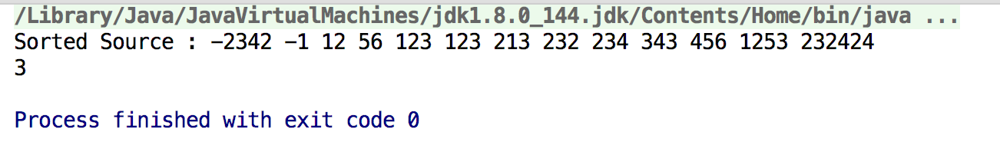

##二分查找的Java实现
###写在前面
二分查找是一个很有趣的算法，可以很大程度的提升性能，比如待查询的数组或其他集合很大的时候，二分查找的威力就可以体现出来。但是平时的工作中我们基本上不会去写二分查找，所以我觉得有必要写一篇博文来记录二分查找的学习。
###二分查找的原理
所谓二分查找，其实就是获取一组<font color='red'>有序</font>数据的中间数据，判断其跟查询关键字的大小，然后得到新的查找区间，继续重复以上的操作，直到最后查询区间不存在或者查询到关键字的下标。这样说起来可能还是有点抽象。So，Talk is cheap， Show me the code!
### 代码实现
```java
/**
 * Author : Ray
 * Created At : 2018-03-13 下午8:41
 * Email : ryu18356@gmail.com
 * Description : 二分查找的实例程序
 */
public class BinarySearchDemo {

    /**
     * 二分查找key值对应的下标
     * @param source 输入的源数组 ，请保证为一个有序数组
     * @param key 需要查找的值
     * @return 正数为查找到的坐标，-1表示没有查到
     */
    public static int binarySearch(int[] source, int key) {
        int low = 0;
        int high = source.length - 1;
        while (low <= high) {
            int mid = ( low + high ) >>> 1; //使用位移运算法高效地获取折中下标，这里不考虑符号，所以使用>>>
            int midVal = source[mid];
            if ( midVal < key ) {
                low = mid + 1;
            } else if ( midVal > key ) {
                high = mid - 1;
            }  else
                return  mid;
        }
        return -1;
    }

    public static void main(String[] args) {
        int[] source = new int[]{12,213,232,343,123,-1,123,232424,1253,56,456,234,-2342};
        //保证数组为有序数组
        Arrays.sort(source);
        //打印排序后的数组元素
        System.out.print("Sorted Source : ");
        for (int i = 0; i < source.length; i++) {
            System.out.print(source[i] + " ");
        }
        System.out.println();
        System.out.println(binarySearch(source, 56));
    }

}
```
最后的运行效果为下图

### 学习感想
其实如果对Java SDK的源码熟悉的话，会一眼看出上面的二分查找其实就是仿写的Arrays.java的binarySearch方法，下面是源码的二分查找

```java
 // Like public version, but without range checks.
    private static int binarySearch0(int[] a, int fromIndex, int toIndex,
                                     int key) {
        int low = fromIndex;
        int high = toIndex - 1;

        while (low <= high) {
            int mid = (low + high) >>> 1;
            int midVal = a[mid];

            if (midVal < key)
                low = mid + 1;
            else if (midVal > key)
                high = mid - 1;
            else
                return mid; // key found
        }
        return -(low + 1);  // key not found.
    }
```
可以看出我们最上面的例子其实就是借鉴Java源码的，Arrays类提供了很多便捷高效的方法，比如sort排序等。最后说一下，二分查找这种我们平时并不会写出来用，因为SDK已经给我们提供了实现。但是我们应该在空闲时间多多关注一下Java源码的实现，毕竟这些都是编程届的巨人们的思想结晶。我们可以通过源码学习很多知识，比如数据结构与算法，设计模式，面向对象编程技巧等，我坚信大多数大牛们之所以牛，就是因为源码读的多，写得多。当然那种天马行空的天才除外！所以，作为平凡人的我们应该掌握一些缩短我们与大牛差距的学习技巧，不要让好的学习资源((ps: 开车我是拒绝的！哈哈：))安静地待在我们的硬盘里。
